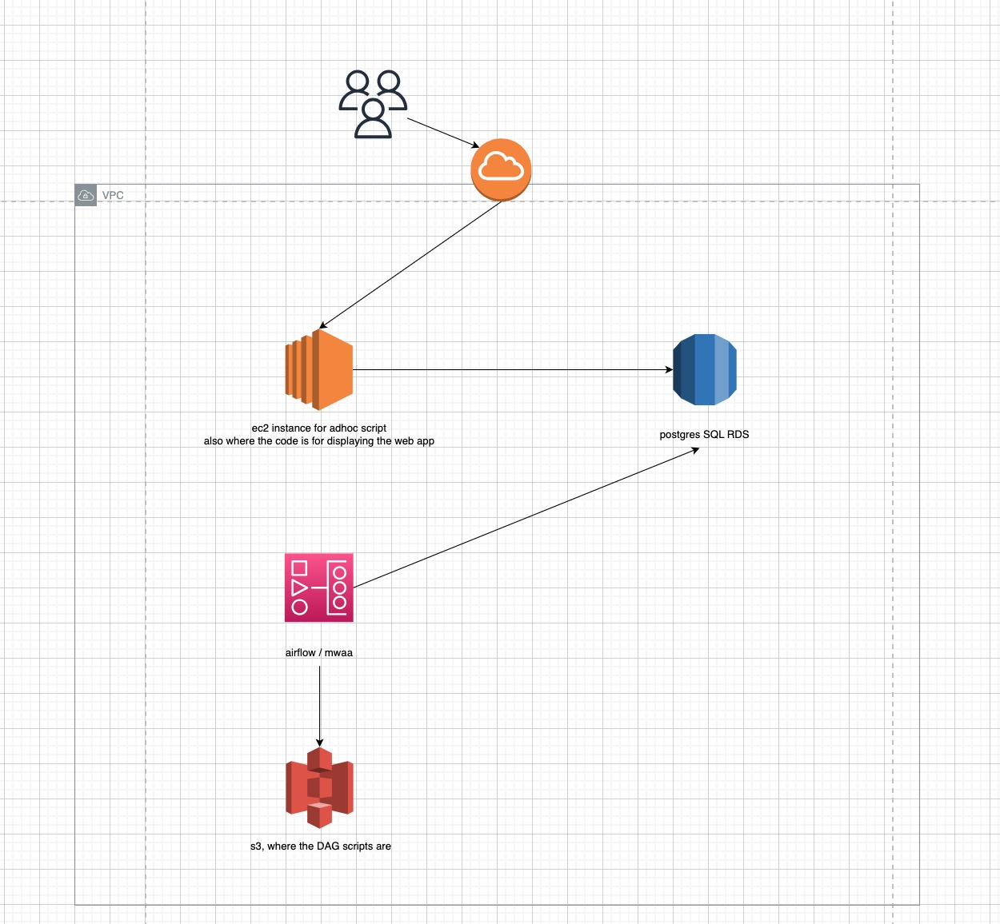

This is the terraform code that creates the infrastructure of the application. I suggest reading the README found in https://github.com/jacobatorres/los_angeles_parking_finder/blob/main/README.md for more context on the resource created.

The important parts of the infrastructure are:

- Airflow / MWAA resource. This populates one of the tables in the database (parking_real_time).
- EC2 instance. This is where the application is hosted, and why we can access the application via http://3.209.240.80:8000/. This also requests data to the RDS, needed when providing the nearest points. We can also use this to run the adhoc scripts to populate some of the tables in the database (business_location and parking_location).
- RDS instance. This is the postgresql database where the data is stored.




To create the infrastructure: git clone this repo, then go to github_repos/terraform/apartment_finder_airflow/examples/basic. Then go to github_repos/terraform/apartment_finder_airflow/examples/basic. Then run `terraform init; terraform plan -out theplan -var-file="secrets.tfvars"; terraform apply theplan`

the terraform will ask for your machine's local IP address, you can put that in the secrets.tfvars file. Here's what my secrets.tfvars looked like:

	```
	app_token_password   = "<REDACTED>"
	data_lacity_password = "<REDACTED>"
	db_username          = "<REDACTED>"
	db_password          = "<REDACTED>"
	my_ip                = "<REDACTED>"
	```


